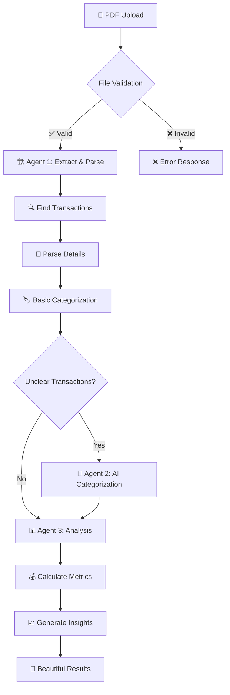

# 🏦 Finances Advisor
*Bank Statement Analyzer + Solucionador de Problemas Financieros v2. 
Video Presentation - [Click Here](https://www.youtube.com/watch?v=kiBZ86F8_SU)*

[](https://python.org)
[](https://streamlit.io)
[](https://openai.com)

## 📋 Table of Contents

- [🎯 Overview](#-overview)
- [✨ Key Features](#-key-features)
- [🏗️ System Architecture](#️-system-architecture)
- [🧠 Meta Analysis Layer](#-meta-analysis-layer)
- [🚀 Quick Start](#-quick-start)
- [💻 Usage](#-usage)
- [📁 Project Structure](#-project-structure)
- [🧪 Testing](#-testing)
- [⚠️ Important Notes](#️-important-notes)
- [🏆 Key Achievements](#-key-achievements)

---

## 🎯 Overview

Transform PDF bank statements into comprehensive financial insights using a hybrid multi-agent system, and solve everyday financial problems with a separate deterministic solver guided by OpenAI only for parsing.

**The Problem**: Manual bank statement analysis and financial problem-solving are time-consuming and error-prone  
**The Solution**: A two-mode Streamlit app that keeps calculations local and uses AI only where it adds value

---

## ✨ Key Features

🚀 **Smart PDF Processing** - Handles multiple bank formats (Chase, Wells Fargo, etc.)  
🧠 **Hybrid Categorization** - 70% deterministic + 30% AI-powered for optimal efficiency  
📊 **Comprehensive Analysis** - Spending patterns, category breakdowns, financial insights  
🛠️ **Human Review Loop** - Editable transaction categories before final advanced advisory  
🧾 **On-Demand Meta Analysis** - Second-stage advisory triggered manually with one additional LLM call  
📚 **Knowledge-Driven Advisory** - Uses `data/advisory_knowledge_base_v1.json` for rules, benchmarks, and playbooks  
🎨 **Beautiful Web Interface** - Professional Streamlit dashboard with interactive charts  
💰 **Transparent Cost Tracking** - Shows base analysis cost, incremental meta-analysis cost, and total cost  
🧮 **Problemas cotidianos v2** - Focus-guided problem parser + deterministic calculator for loans, present/future value, amortization, depreciation, and cash flows

---

## 🏗️ System Architecture

### Bank Statement Analyzer: Three-Agent Design

```
🏗️ Agent 1: Document Processor (0 LLM)
├── PDF extraction & transaction parsing  
├── Basic categorization via keywords
└── Handles 70% of transactions instantly

🧠 Agent 2: Content Analyzer (1 LLM)  
├── AI categorization for unclear transactions
├── Batch processing for efficiency
└── Handles remaining 30% intelligently

📊 Agent 3: Analysis Generator (0-1 LLM)
├── Financial calculations & insights
├── Report generation & visualizations  
└── Optional AI recommendations
```

### The Journey of Your Data 📈



### Processing Intelligence 🎯

```
📄 PDF Bank Statement
    ↓ 
🔍 Validation → 🏗️ Agent 1: Extract & Parse → 🏷️ Basic Categorization (70% done!)
    ↓
🧠 Agent 2: AI handles unclear cases (30%) → ✅ 100% categorized
    ↓  
📊 Agent 3: Financial analysis → ✍️ Human category review (optional edits) → 🧠 Meta analysis button (optional) → 🎨 Beautiful dashboard
```

### Problemas cotidianos v2: Parser + Calculator

```
🧠 User problem in natural language
    ↓
🔍 LLM parser extracts structure and assumptions only
    ↓
✅ User validates parsed values and assumptions
    ↓
🧮 Deterministic calculator computes the results locally
    ↓
🎨 Results table with assumptions highlighted
```

---

## 🧠 Meta Analysis Layer

The software includes a second advisory layer designed to run only after human review.

### How It Works
1. Run the standard analysis pipeline (Agents 1-3).
2. Review and adjust categories in the transaction editor.
   - Rename any of the three session-only auxiliary categories when a personal
     tracking bucket is useful (for example, `Hermana enferma`).
   - Assign a custom category to one expense or select several rows and apply it
     in bulk.
   - Custom categories replace the visible financial category for the current
     report, but never create merchant-learning rules.
3. Click **Run Meta Analysis** to trigger one additional LLM call.
4. Review a structured advisory report with:
   - Summary metrics
   - Category-level spend analysis
   - Ratio interpretation
   - Detected issues
   - Actionable recommendations
   - Executive summary narrative

### Why It Is Safe and Non-Intrusive
- The base workflow remains unchanged.
- Meta analysis is **manual** (not automatic).
- Results are tied to the current reviewed report state.
- Advisory output explicitly warns that expert validation is required.
- User-defined categories are marked as temporary tracking buckets and are not
  inferred to be fixed, variable, or discretionary from their names.

### Temporary Custom Categories and Session Privacy

- Every new session starts with `Auxiliar 1`, `Auxiliar 2`, and `Auxiliar 3`.
- Names and assignments live only in Streamlit session state; no custom-category
  configuration or assignment is written to disk.
- An auxiliary category appears in reports only after at least one effective
  spending transaction is assigned to it.
- The original automatic category is retained internally for traceability, but
  it is not double-counted in the visible report.
- **Finalizar sesión y borrar datos** immediately clears uploaded-statement
  results, filters, custom names, assignments, and advisory state.
- Only corrections to standard financial categories may persist as normalized
  merchant rules in `data/user_category_rules.json`.

### Cost Model
- Base analysis: existing cost from Agent flow.
- Meta analysis: additional incremental cost for one extra LLM call.
- UI displays:
  - Meta LLM calls
  - Meta cost
  - Total accumulated cost

---

## 🚀 Quick Start

### Installation
```bash
# Setup
git clone <repository-url>
cd personal-finance-advisor
python -m venv venv
source venv/bin/activate

# Windows PowerShell
# .\venv\Scripts\Activate.ps1

# Install dependencies
pip install -r requirements.txt

# Configure API key
echo "OPENAI_API_KEY=your_key_here" > .env

# Launch web interface
streamlit run streamlit_app.py
```

### Streamlit Cloud Deployment
1. Push the repository to GitHub.
2. Open [Streamlit Community Cloud](https://streamlit.io/cloud) and create a new app from your repo.
3. Set the main file path to `streamlit_app.py`.
4. Add `OPENAI_API_KEY` in the app's Secrets panel, not in the repository.
5. Deploy and test with non-sensitive documents first.

Example secret format in Streamlit Cloud:
```toml
OPENAI_API_KEY = "your_key_here"
```

Local alternative for Streamlit secrets:
1. Create `.streamlit/secrets.toml` if you want to mirror Cloud locally.
2. Put the same `OPENAI_API_KEY` entry there.
3. Keep that file out of Git; only `.streamlit/secrets.toml.example` should be shared.

### First Analysis
1. Open browser to `http://localhost:8501`
2. Use the sidebar to choose between `Análisis de cartola` and `Problemas cotidianos`
3. Upload a bank statement PDF or enter a financial problem in natural language
4. Review the results and adjust parameters when needed

---

## 💻 Usage

### Web Interface (Recommended)
```bash
streamlit run streamlit_app.py
```
Professional dashboard with drag-and-drop upload, interactive visualizations, manual category correction, optional meta-analysis reporting, and the new `Problemas cotidianos` solver.

### Problemas cotidianos v2 Standalone
```bash
streamlit run streamlit_problem_solver_v2.py
```
Standalone solver for loans, present value, future value, amortization, depreciation, and cash-flow problems.

### Command Line
```bash
python main_coordinator.py
```
Terminal interface for batch processing and automation.

### Platform Notes
- macOS and Linux: use `source venv/bin/activate`
- Windows PowerShell: use `venv\Scripts\Activate.ps1`
- The app itself is cross-platform; only the shell activation command changes.
- For Streamlit Cloud, prefer app Secrets over `.env`.

### Python API
```python
from main_coordinator import BankStatementAnalyzer

analyzer = BankStatementAnalyzer("your-api-key")
result = analyzer.analyze_statement("statement.pdf")
```

---

## 📁 Project Structure

```
Finances_Advisor/
├── streamlit_app.py              # Web interface
├── streamlit_problem_solver_v2.py # Standalone financial problem solver
├── main_coordinator.py           # System orchestration
├── agents/                       # Core agents
│   ├── document_processor.py     # Agent 1: PDF processing
│   ├── content_analyzer.py       # Agent 2: AI categorization
│   └── analysis_generator.py     # Agent 3: Financial analysis
├── data/
│   ├── user_category_rules.json          # Learned user category overrides
│   └── advisory_knowledge_base_v1.json   # Knowledge base for meta-analysis rules/benchmarks/playbooks
├── utils/                        # Shared utilities
│   ├── llm_interface.py          # AI management
│   ├── merchant_database.py      # Categorization rules
│   ├── custom_categories.py      # Session-only custom-category validation
│   ├── llm_problem_parser.py     # LLM parser for Problemas cotidianos
│   └── financial_calculator_v2.py # Deterministic calculator for solver v2
├── tests/                        # Test suite
│   ├── test_problem_solver_v2.py # Tests for the new solver
│   ├── test_custom_categories.py # Custom-category validation and assignment tests
│   └── test_custom_category_analysis.py # Reporting and meta-analysis tests
└── bank_statements/              # Sample data
```

---

## 🧪 Testing

### Run Tests
```bash
# Complete system test
pytest tests/test_complete_system.py

# Individual components
pytest tests/test_agent1.py    # PDF processing
pytest tests/test_agent2.py    # AI categorization
pytest tests/test_problem_solver_v2.py
```

### Test Coverage
- End-to-end system integration
- Individual agent functionality  
- Error handling and edge cases
- Performance validation
- Multi-format PDF compatibility

---

## ⚠️ Important Notes

### 🔒 Security Warning

**Security posture**: the app only makes one external call, to OpenAI API via `OPENAI_API_KEY`. All financial calculations and local processing run inside the app.

**⚠️ EDUCATIONAL PROJECT ONLY**

This system is designed for learning purposes and lacks production security requirements:
- No encryption for sensitive data
- No secure authentication systems
- No regulatory compliance features

**For educational use only** - Use synthetic data or heavily redacted samples.

### 💡 Development Philosophy

**"Use AI only where it adds unique value"**

- **Deterministic First**: Handle obvious cases (Starbucks → Food) without AI
- **Strategic AI**: Use intelligence for truly ambiguous transactions  
- **Cost Conscious**: Batch processing minimizes API usage
- **Reliable Foundation**: Consistent results through deterministic processing

### 🧾 Advisory Governance

- Meta advisory recommendations are generated from a structured knowledge base.
- Human review is required before acting on recommendations.
- The system separates base analysis from second-stage advisory to keep control explicit.

---

## 🏆 Key Achievements

### Technical Excellence
- **Hybrid Architecture**: Optimal balance of speed, accuracy, and cost
- **Multi-Format Support**: Robust PDF processing across bank types
- **Professional Interface**: Web dashboard with interactive visualizations
- **Performance Optimization**: 70% deterministic processing reduces costs significantly

### Innovation
- **Intelligent Resource Usage**: AI used strategically where most valuable
- **Batch Optimization**: Single AI call handles multiple unclear transactions
- **Extensible Design**: Easy to add new banks, categories, and features
- **User Experience**: Makes financial data analysis accessible and enjoyable

---

*Transform your financial data into insights that matter* 💰✨
